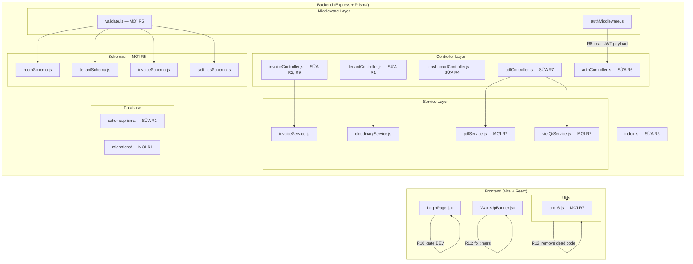
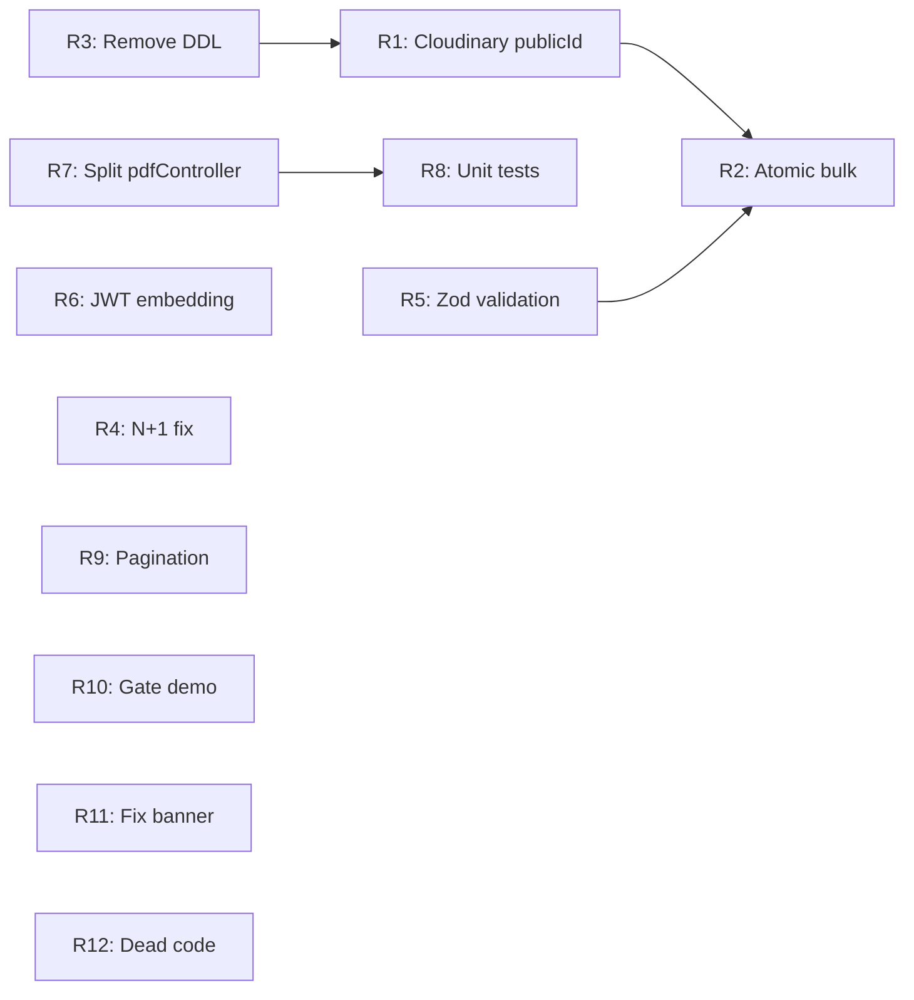

# Design Document — Architecture Refactoring

## Overview

Tài liệu thiết kế kỹ thuật cho 12 khuyến nghị tái cấu trúc (R1–R12) được xác định trong `ARCHITECTURE_REVIEW.md`. Các thay đổi được nhóm theo 3 mức ưu tiên và thiết kế để có thể triển khai tuần tự mà không phá vỡ hệ thống hiện tại.

### Phạm vi thay đổi

- **Backend**: 9 thay đổi (R1–R9) bao gồm schema migration, controller refactor, service extraction, validation layer, và test infrastructure.
- **Frontend**: 3 thay đổi (R10–R12) bao gồm conditional rendering, timer fix, và dead code removal.

### Nguyên tắc thiết kế

1. **Backward compatibility**: Mọi API response shape hiện tại được bảo toàn trừ khi có thay đổi rõ ràng (R9 thêm `meta`).
2. **Incremental delivery**: Mỗi R có thể deploy độc lập (trừ dependency graph bên dưới).
3. **Zero downtime**: Không có breaking change nào yêu cầu frontend và backend deploy đồng thời.

## Architecture

### High-Level Diagram — Trước và Sau



## Components and Interfaces

### R1 — Cloudinary publicId Storage & Cleanup

**Files thay đổi:**
- `backend/prisma/schema.prisma` — Thêm `publicId String?` vào model `TenantFile`
- `backend/prisma/migrations/YYYYMMDD_add_public_id_to_tenant_file/migration.sql` — Migration mới
- `backend/src/controllers/tenantController.js` — Sửa `uploadFile`, `deleteFile`, `deleteTenant`

**Interface changes:**

```javascript
// tenantController.uploadFile — thêm publicId vào data
const file = await prisma.tenantFile.create({
  data: {
    tenantId: tenant.id,
    label: label || req.file.originalname,
    url: result.secure_url,
    publicId: result.public_id, // MỚI
  },
});

// tenantController.deleteFile — thêm Cloudinary cleanup
exports.deleteFile = async (req, res, next) => {
  // ... existing tenant/file lookup ...
  if (file.publicId) {
    await deleteFromCloudinary(file.publicId); // throws on failure → stops deletion
  } else {
    console.warn(`[Cloudinary] TenantFile ${file.id} has no publicId, skipping cloud delete`);
  }
  await prisma.tenantFile.delete({ where: { id: file.id } });
  res.json({ success: true, message: 'Đã xóa file' });
};

// tenantController.deleteTenant — cleanup files before transaction
exports.deleteTenant = async (req, res, next) => {
  // ... existing tenant lookup ...
  const files = await prisma.tenantFile.findMany({ where: { tenantId: tenant.id } });
  for (const file of files) {
    if (file.publicId) {
      await deleteFromCloudinary(file.publicId);
    } else {
      console.warn(`[Cloudinary] TenantFile ${file.id} has no publicId, skipping`);
    }
  }
  await prisma.$transaction([
    prisma.tenantFile.deleteMany({ where: { tenantId: tenant.id } }),
    prisma.invoice.deleteMany({ where: { tenantId: tenant.id } }),
    prisma.tenant.delete({ where: { id: tenant.id } }),
  ]);
  // ... rest unchanged ...
};
```

### R2 — Atomic bulkCreateInvoices

**Files thay đổi:**
- `backend/src/controllers/invoiceController.js` — Refactor `bulkCreateInvoices`

**Design pattern:** Pre-compute → Validate → Transaction

```javascript
exports.bulkCreateInvoices = async (req, res, next) => {
  try {
    const { month, year, readings = {} } = req.body;
    if (!month || !year) {
      return res.status(400).json({ success: false, message: 'Thiếu tháng/năm', code: 'VALIDATION_ERROR' });
    }

    const rooms = await prisma.room.findMany({
      where: { userId: req.user.id, status: 'OCCUPIED' },
      include: { tenants: { where: { active: true } } },
    });

    const periodStart = new Date(year, month - 1, 1);
    const periodEnd = new Date(year, month, 0);
    const skipped = [];
    const invoiceDataList = []; // Pre-compute all data

    for (const room of rooms) {
      const tenant = room.tenants[0];
      if (!tenant) continue;

      // Check existing (outside transaction)
      const existing = await prisma.invoice.findFirst({
        where: { roomId: room.id, tenantId: tenant.id, month: Number(month), year: Number(year) },
      });
      if (existing) { skipped.push(room.name); continue; }

      // Pre-compute invoice data
      const lastInvoice = await prisma.invoice.findFirst({
        where: { roomId: room.id },
        orderBy: [{ year: 'desc' }, { month: 'desc' }],
      });
      const roomReadings = readings[room.id] || {};
      // ... (same reading logic as current) ...
      const data = { /* computed invoice data object */ };
      invoiceDataList.push(data);
    }

    // Atomic transaction — all or nothing
    const created = await prisma.$transaction(
      invoiceDataList.map(data => prisma.invoice.create({ data }))
    );

    res.status(201).json({
      success: true,
      message: `Đã tạo ${created.length} hóa đơn. Bỏ qua: ${skipped.join(', ') || 'không có'}`,
      data: { created: created.length, skipped: skipped.length, skippedRooms: skipped },
    });
  } catch (err) { next(err); }
};
```

**Key design decisions:**
- Validation và skip logic chạy **ngoài** transaction (read-only, idempotent).
- Chỉ `prisma.invoice.create()` calls nằm **trong** transaction.
- Nếu bất kỳ create nào fail (ví dụ unique constraint), toàn bộ rollback.

### R3 — Remove Runtime DDL

**Files thay đổi:**
- `backend/src/index.js` — Xóa `ensureDatabaseSchema()` và lời gọi

**Trước:**
```javascript
const ensureDatabaseSchema = async () => {
  try {
    await prisma.$executeRawUnsafe('ALTER TABLE "Settings" ADD COLUMN IF NOT EXISTS "paymentInfo" TEXT;');
  } catch (err) { /* ... */ }
};
const PORT = process.env.PORT || 5000;
ensureDatabaseSchema().then(() => {
  app.listen(PORT, () => console.log(`🚀 Server running on port ${PORT}`));
});
```

**Sau:**
```javascript
const PORT = process.env.PORT || 5000;
app.listen(PORT, () => console.log(`🚀 Server running on port ${PORT}`));
```

**Verification:** Migration `20260428000000_add_payment_info` đã chứa `ALTER TABLE "Settings" ADD COLUMN "paymentInfo" TEXT;` — đủ để quản lý cột này qua Prisma migrate.

### R4 — Eliminate N+1 in Dashboard Charts

**Files thay đổi:**
- `backend/src/controllers/dashboardController.js` — Rewrite `getRevenueChart`, `getOccupancyChart`

**getRevenueChart — Single aggregation query:**

```javascript
exports.getRevenueChart = async (req, res, next) => {
  try {
    const userId = req.user.id;
    const now = new Date();
    const sixMonthsAgo = new Date(now.getFullYear(), now.getMonth() - 5, 1);

    const results = await prisma.$queryRaw`
      SELECT month, year,
             COALESCE(SUM(CASE WHEN "paidAmount" IS NOT NULL THEN "paidAmount" ELSE "totalAmount" END), 0)::int as revenue
      FROM "Invoice"
      WHERE "userId" = ${userId}
        AND paid = true
        AND "createdAt" >= ${sixMonthsAgo}
      GROUP BY year, month
      ORDER BY year ASC, month ASC
    `;

    // Fill missing months with revenue: 0
    const data = [];
    for (let i = 5; i >= 0; i--) {
      const d = new Date(now.getFullYear(), now.getMonth() - i, 1);
      const month = d.getMonth() + 1;
      const year = d.getFullYear();
      const found = results.find(r => r.month === month && r.year === year);
      data.push({ month: `${month}/${year}`, revenue: found ? Number(found.revenue) : 0 });
    }

    res.json({ success: true, data });
  } catch (err) { next(err); }
};
```

**getOccupancyChart — Two queries (1 count + 1 aggregation):**

```javascript
exports.getOccupancyChart = async (req, res, next) => {
  try {
    const userId = req.user.id;
    const now = new Date();
    const totalRooms = await prisma.room.count({ where: { userId } });
    const sixMonthsAgo = new Date(now.getFullYear(), now.getMonth() - 5, 1);

    const results = await prisma.$queryRaw`
      SELECT month, year, COUNT(DISTINCT "roomId")::int as occupied
      FROM "Invoice"
      WHERE "userId" = ${userId}
        AND "createdAt" >= ${sixMonthsAgo}
      GROUP BY year, month
      ORDER BY year ASC, month ASC
    `;

    const data = [];
    for (let i = 5; i >= 0; i--) {
      const d = new Date(now.getFullYear(), now.getMonth() - i, 1);
      const month = d.getMonth() + 1;
      const year = d.getFullYear();
      const found = results.find(r => r.month === month && r.year === year);
      const occupied = found ? Number(found.occupied) : 0;
      const rate = totalRooms > 0 ? Math.round((occupied / totalRooms) * 100) : 0;
      data.push({ month: `${month}/${year}`, rate, occupied, total: totalRooms });
    }

    res.json({ success: true, data });
  } catch (err) { next(err); }
};
```

**Output shape bảo toàn:**
- Revenue: `{ month: 'M/YYYY', revenue: number }`
- Occupancy: `{ month: 'M/YYYY', rate: number, occupied: number, total: number }`

### R5 — Zod Validation Middleware

**Files mới:**
- `backend/src/middlewares/validate.js`
- `backend/src/schemas/roomSchema.js`
- `backend/src/schemas/tenantSchema.js`
- `backend/src/schemas/invoiceSchema.js`
- `backend/src/schemas/settingsSchema.js`

**Files thay đổi:**
- `backend/src/routes/roomRoutes.js` — Wire validate middleware
- `backend/src/routes/tenantRoutes.js` — Wire validate middleware
- `backend/src/routes/invoiceRoutes.js` — Wire validate middleware
- `backend/src/routes/settingsRoutes.js` — Wire validate middleware

**validate.js:**

```javascript
const validate = (schema) => (req, res, next) => {
  const result = schema.safeParse(req.body);
  if (!result.success) {
    return res.status(400).json({
      success: false,
      message: 'Dữ liệu không hợp lệ',
      code: 'VALIDATION_ERROR',
      errors: result.error.flatten(),
    });
  }
  req.body = result.data;
  next();
};

module.exports = validate;
```

**roomSchema.js:**

```javascript
const { z } = require('zod');

const createRoomSchema = z.object({
  name: z.string().min(1, 'Tên phòng không được để trống'),
  floor: z.number().int().optional().nullable(),
  area: z.number().positive().optional().nullable(),
  baseRent: z.number().int().positive('Tiền phòng phải là số nguyên dương'),
  electricPrice: z.number().int().positive('Giá điện phải là số nguyên dương').default(3500),
  waterPrice: z.number().int().positive('Giá nước phải là số nguyên dương').default(15000),
  garbageFee: z.number().int().nonnegative('Phí rác phải >= 0').default(20000),
});

const updateRoomSchema = createRoomSchema.partial();

module.exports = { createRoomSchema, updateRoomSchema };
```

**invoiceSchema.js:**

```javascript
const { z } = require('zod');

const createInvoiceSchema = z.object({
  roomId: z.number().int().positive(),
  tenantId: z.number().int().positive(),
  month: z.number().int().min(1).max(12),
  year: z.number().int().min(2020).max(2100),
  electricityPrev: z.number().int().nonnegative(),
  electricityNow: z.number().int().nonnegative(),
  waterPrev: z.number().int().nonnegative(),
  waterNow: z.number().int().nonnegative(),
  otherFees: z.number().nonnegative().default(0),
  otherNote: z.string().optional().nullable(),
  periodStart: z.string().optional(),
  periodEnd: z.string().optional(),
  note: z.string().optional().nullable(),
}).refine(data => data.electricityNow >= data.electricityPrev, {
  message: 'Chỉ số điện mới phải >= chỉ số cũ',
  path: ['electricityNow'],
}).refine(data => data.waterNow >= data.waterPrev, {
  message: 'Chỉ số nước mới phải >= chỉ số cũ',
  path: ['waterNow'],
});

const bulkCreateInvoiceSchema = z.object({
  month: z.number().int().min(1).max(12),
  year: z.number().int().min(2020).max(2100),
  readings: z.record(z.string(), z.object({
    electricityPrev: z.union([z.number(), z.string()]).optional(),
    electricityNow: z.union([z.number(), z.string()]).optional(),
    waterPrev: z.union([z.number(), z.string()]).optional(),
    waterNow: z.union([z.number(), z.string()]).optional(),
  })).optional().default({}),
});

module.exports = { createInvoiceSchema, bulkCreateInvoiceSchema };
```

**settingsSchema.js:**

```javascript
const { z } = require('zod');

const updateSettingsSchema = z.object({
  shopName: z.string().min(1).optional(),
  address: z.string().optional(),
  phone: z.string().optional(),
  paymentInfo: z.string().optional().nullable(),
  webhookUrl: z.string().url('URL webhook không hợp lệ').startsWith('https://', 'URL phải bắt đầu bằng https://').or(z.literal('')).optional(),
});

module.exports = { updateSettingsSchema };
```

### R6 — JWT User Embedding

**Files thay đổi:**
- `backend/src/controllers/authController.js` — Sửa `genAccessToken`
- `backend/src/middlewares/authMiddleware.js` — Đọc từ payload, bỏ DB lookup

**authController.js:**

```javascript
// TRƯỚC: const genAccessToken = (id) => jwt.sign({ id }, process.env.JWT_SECRET, { expiresIn: '15m' });
// SAU:
const genAccessToken = (user) => jwt.sign(
  { id: user.id, email: user.email, name: user.name },
  process.env.JWT_SECRET,
  { expiresIn: '15m' }
);

// Cập nhật tất cả call sites:
// login:  genAccessToken(user)  thay vì genAccessToken(user.id)
// register: genAccessToken(user)
// refresh: cần fetch user từ DB để lấy email/name
```

**authMiddleware.js:**

```javascript
const jwt = require('jsonwebtoken');

const protect = async (req, res, next) => {
  const auth = req.headers.authorization;
  if (!auth || !auth.startsWith('Bearer ')) {
    return res.status(401).json({ success: false, message: 'Không có quyền truy cập', code: 'UNAUTHORIZED' });
  }
  try {
    const token = auth.split(' ')[1];
    const decoded = jwt.verify(token, process.env.JWT_SECRET);

    // Guard: reject old tokens missing email/name
    if (!decoded.email || !decoded.name) {
      return res.status(401).json({ success: false, message: 'Token cũ, vui lòng đăng nhập lại', code: 'UNAUTHORIZED' });
    }

    req.user = { id: decoded.id, email: decoded.email, name: decoded.name };
    next();
  } catch {
    res.status(401).json({ success: false, message: 'Token không hợp lệ hoặc đã hết hạn', code: 'UNAUTHORIZED' });
  }
};

module.exports = protect;
```

**Lưu ý:** `refresh` endpoint cần fetch user từ DB để embed email/name vào token mới (vì refresh token chỉ chứa `id`).

### R7 — Split pdfController God Object

**Files mới:**
- `backend/src/utils/crc16.js`
- `backend/src/services/vietQrService.js`
- `backend/src/services/pdfService.js`

**Files thay đổi:**
- `backend/src/controllers/pdfController.js` — Slim down to thin handler

**crc16.js:**

```javascript
/**
 * CRC-16/CCITT (polynomial 0x1021, init 0xFFFF)
 * @param {string} str - Input string
 * @returns {string} 4-char uppercase hex CRC
 */
const crc16 = (str) => {
  let crc = 0xFFFF;
  const polynomial = 0x1021;
  for (let i = 0; i < str.length; i++) {
    crc ^= (str.charCodeAt(i) << 8);
    for (let j = 0; j < 8; j++) {
      if ((crc & 0x8000) !== 0) {
        crc = ((crc << 1) ^ polynomial) & 0xFFFF;
      } else {
        crc = (crc << 1) & 0xFFFF;
      }
    }
  }
  return crc.toString(16).toUpperCase().padStart(4, '0');
};

module.exports = { crc16 };
```

**vietQrService.js exports:**
- `bankBinMap` — Object mapping bank names to BIN codes
- `parsePaymentInfo(text)` — Parse payment info string → `{ isRawVietQR, rawString }` | `{ isRawVietQR, bankBin, accountNumber }` | `null`
- `buildVietQRString(bankBin, accountNumber, amount, description, merchantName, merchantCity)` — Build EMVCo QR string

**pdfService.js exports:**
- `generateInvoicePdf(invoice, settings)` → `Promise<Uint8Array>` — Full PDF generation logic

**pdfController.js (thin handler):**

```javascript
const prisma = require('../config/db');
const { generateInvoicePdf } = require('../services/pdfService');

exports.getInvoicePdf = async (req, res, next) => {
  try {
    const invoice = await prisma.invoice.findFirst({
      where: { id: Number(req.params.id), userId: req.user.id },
      include: {
        room: true,
        tenant: true,
        user: { include: { settings: true } },
      },
    });
    if (!invoice) {
      return res.status(404).json({ success: false, message: 'Hóa đơn không tồn tại', code: 'NOT_FOUND' });
    }

    const pdfBytes = await generateInvoicePdf(invoice, invoice.user.settings);

    res.setHeader('Content-Type', 'application/pdf');
    res.setHeader('Content-Disposition',
      `inline; filename=hoadon-${invoice.room.name}-${invoice.month}-${invoice.year}.pdf`);
    res.send(Buffer.from(pdfBytes));
  } catch (err) { next(err); }
};

// Re-export for backward compatibility with existing tests
exports.parsePaymentInfo = require('../services/vietQrService').parsePaymentInfo;
exports.buildVietQRString = require('../services/vietQrService').buildVietQRString;
```

### R8 — Unit Tests for invoiceService

**Files mới:**
- `backend/src/services/invoiceService.test.js`

**Files thay đổi:**
- `backend/package.json` — Thêm `vitest` devDependency, sửa `test` script

**package.json changes:**

```json
{
  "scripts": {
    "test": "vitest run"
  },
  "devDependencies": {
    "vitest": "^3.0.0"
  }
}
```

**Test file structure:**

```javascript
import { describe, it, expect } from 'vitest';
const { calculateTotal } = require('./invoiceService');

describe('calculateTotal', () => {
  it('tháng đầy đủ — 30 ngày tháng 6', () => { /* ... */ });
  it('tháng đầy đủ — 31 ngày tháng 1', () => { /* ... */ });
  it('pro-rata — thuê từ ngày 15', () => { /* ... */ });
  it('pro-rata — thuê 1 ngày duy nhất', () => { /* ... */ });
  it('đồng hồ reset — electricityNow < electricityPrev', () => { /* ... */ });
  it('tháng 2 năm nhuận — 29 ngày', () => { /* ... */ });
  it('baseRent = 0 — phòng miễn phí', () => { /* ... */ });
  it('otherFees là số thập phân', () => { /* ... */ });
});
```

### R9 — Invoice List Pagination

**Files thay đổi:**
- `backend/src/controllers/invoiceController.js` — Sửa `getInvoices`

**Implementation:**

```javascript
exports.getInvoices = async (req, res, next) => {
  try {
    const { month, year, roomId, paid, page: pageStr, limit: limitStr } = req.query;

    // Parse & clamp pagination params
    let page = parseInt(pageStr, 10);
    let limit = parseInt(limitStr, 10);
    if (!Number.isInteger(page) || page < 1) page = 1;
    if (!Number.isInteger(limit) || limit < 1) limit = 50;
    if (limit > 200) limit = 200;

    const where = {
      userId: req.user.id,
      ...(month && { month: Number(month) }),
      ...(year && { year: Number(year) }),
      ...(roomId && { roomId: Number(roomId) }),
      ...(paid !== undefined && { paid: paid === 'true' }),
    };

    const [invoices, total] = await Promise.all([
      prisma.invoice.findMany({
        where,
        include: {
          room: { select: { id: true, name: true } },
          tenant: { select: { id: true, name: true, phone: true } },
        },
        orderBy: [{ year: 'desc' }, { month: 'desc' }, { createdAt: 'desc' }],
        skip: (page - 1) * limit,
        take: limit,
      }),
      prisma.invoice.count({ where }),
    ]);

    const totalPages = Math.ceil(total / limit);

    res.json({
      success: true,
      data: invoices,
      meta: { total, page, limit, totalPages },
    });
  } catch (err) { next(err); }
};
```

### R10 — Gate Demo Credentials

**Files thay đổi:**
- `frontend/src/pages/LoginPage.jsx`

**Thay đổi:**

```jsx
{/* Trước: luôn render */}
{import.meta.env.DEV && (
  <div className="mt-8 p-5 bg-[#FCFAF6] border border-emerald-100/20 rounded-2xl">
    <p className="text-xs font-bold text-slate-400 uppercase tracking-wider mb-2">Tài khoản trải nghiệm</p>
    <div className="space-y-1 text-xs text-slate-600 font-medium">
      <p>Email: <code className="...">admin@test.com</code></p>
      <p>Mật khẩu: <code className="...">password123</code></p>
    </div>
  </div>
)}
```

### R11 — Fix WakeUpBanner

**Files thay đổi:**
- `frontend/src/components/WakeUpBanner.jsx`

**Implementation:**

```jsx
import { useState, useEffect } from 'react';
import API from '../services/api';

export default function WakeUpBanner() {
  const [waking, setWaking] = useState(false);

  useEffect(() => {
    const showTimer = setTimeout(() => setWaking(true), 10000);
    const hideTimer = setTimeout(() => setWaking(false), 60000); // Auto-hide after 60s

    API.get('/health')
      .then(() => {
        clearTimeout(showTimer);
        clearTimeout(hideTimer);
        setWaking(false);
      })
      .catch(() => {
        clearTimeout(showTimer);
        setWaking(true); // Show banner on error instead of swallowing
      });

    return () => {
      clearTimeout(showTimer);
      clearTimeout(hideTimer);
    };
  }, []);

  if (!waking) return null;
  return (
    <div className="fixed top-0 left-0 right-0 bg-amber-100 border-b border-amber-300 text-amber-800 text-sm text-center py-2 z-50">
      ⏳ Hệ thống đang khởi động, vui lòng chờ vài giây...
    </div>
  );
}
```

**Key changes:**
1. Thêm `hideTimer` (60s) — auto-hide banner sau tối đa 60 giây.
2. `.catch()` hiển thị banner thay vì nuốt lỗi.
3. Cleanup cả hai timer khi health check thành công.
4. Cleanup cả hai timer khi unmount.

### R12 — Remove Dead Code

**Files thay đổi:**
- `frontend/src/lib/utils.js` — Xóa `ROOM_STATUS_COLORS` export

**Trước:**
```javascript
export const ROOM_STATUS_COLORS = {
  AVAILABLE: 'bg-green-100 text-green-800',
  OCCUPIED: 'bg-blue-100 text-blue-800',
  MAINTENANCE: 'bg-yellow-100 text-yellow-800',
};
```

**Sau:** Xóa hoàn toàn block trên. Giữ nguyên `ROOM_STATUS_LABELS`.

## Data Models

### Prisma Schema Diff (R1)

```diff
model TenantFile {
  id        Int      @id @default(autoincrement())
  tenantId  Int
  tenant    Tenant   @relation(fields: [tenantId], references: [id], onDelete: Cascade)
  label     String
  url       String
+ publicId  String?
  createdAt DateTime @default(now())
}
```

### Migration Strategy

**Migration file:** `backend/prisma/migrations/YYYYMMDD_add_public_id_to_tenant_file/migration.sql`

```sql
-- AlterTable
ALTER TABLE "TenantFile" ADD COLUMN "publicId" TEXT;
```

**Rollout:**
1. Deploy migration trước (thêm nullable column — non-breaking).
2. Deploy code mới (bắt đầu ghi `publicId` cho file mới).
3. File cũ không có `publicId` → xử lý graceful (log warning, skip Cloudinary delete).

### API Contract Changes

**R9 — Pagination response (NEW):**

```typescript
// GET /api/invoices?page=1&limit=50&month=6&year=2026
{
  success: true,
  data: Invoice[],        // max `limit` items
  meta: {
    total: number,        // total matching records
    page: number,         // current page (1-indexed)
    limit: number,        // items per page
    totalPages: number    // ceil(total / limit)
  }
}
```

**R6 — JWT payload change (INTERNAL):**

```typescript
// TRƯỚC: JWT payload = { id: number, iat, exp }
// SAU:   JWT payload = { id: number, email: string, name: string, iat, exp }
```

**Breaking change cho frontend:** Không. Frontend đọc user info từ login response, không decode JWT.

## Dependency Graph



### Dependency Explanation

| Change | Depends On | Reason |
|--------|-----------|--------|
| R1 | R3 | R3 xóa DDL runtime, R1 thêm migration mới — cần đảm bảo migration pipeline hoạt động trước |
| R2 | R1, R5 | R2 refactor `bulkCreateInvoices` — nên có validation (R5) sẵn và schema ổn định (R1) |
| R8 | R7 | Test file cần import từ `vietQrService.js` (tách từ R7) |
| R4 | — | Độc lập |
| R5 | — | Độc lập |
| R6 | — | Độc lập |
| R9 | — | Độc lập |
| R10 | — | Độc lập |
| R11 | — | Độc lập |
| R12 | — | Độc lập |

### Recommended Rollout Order

```
Phase 1 (P1 — Sửa ngay):
  1. R3 — Remove DDL (trivial, unblocks migration confidence)
  2. R1 — Cloudinary publicId (schema migration + controller fix)
  3. R2 — Atomic bulkCreateInvoices

Phase 2 (P2 — Giá trị cao):
  4. R6 — JWT embedding (independent, immediate perf gain)
  5. R5 — Zod validation middleware
  6. R4 — N+1 dashboard fix

Phase 3 (P3 — Cải tiến cấu trúc):
  7. R7 — Split pdfController
  8. R8 — Unit tests (after R7 creates importable modules)
  9. R9 — Pagination

Phase 4 (Frontend — Trivial):
  10. R10 — Gate demo credentials
  11. R11 — Fix WakeUpBanner
  12. R12 — Remove dead code
```

## Correctness Properties

*A property is a characteristic or behavior that should hold true across all valid executions of a system — essentially, a formal statement about what the system should do. Properties serve as the bridge between human-readable specifications and machine-verifiable correctness guarantees.*

### Property 1: Atomicity Invariant for Bulk Invoice Creation

*For any* set of N eligible rooms and any failure point k (1 ≤ k ≤ N) during `bulkCreateInvoices`, the total number of invoices in the database after the failed call SHALL equal the number before the call (zero net change).

**Validates: Requirements 2.1, 2.2, 2.4**

### Property 2: Revenue Chart Model Equivalence

*For any* set of invoice records belonging to a user, the revenue data returned by the new single-query `getRevenueChart` implementation SHALL produce identical output (same `month` labels and `revenue` values) as the original 6-iteration loop implementation.

**Validates: Requirements 4.1, 4.5**

### Property 3: Occupancy Chart Model Equivalence

*For any* set of invoice records and room count belonging to a user, the occupancy data returned by the new aggregation-based `getOccupancyChart` implementation SHALL produce identical output (same `month`, `rate`, `occupied`, `total` values) as the original 6-iteration loop implementation.

**Validates: Requirements 4.2, 4.5**

### Property 4: Validation Middleware Rejects All Invalid Inputs

*For any* request body that violates a Zod schema constraint (missing required field, wrong type, or business rule violation such as `electricityNow < electricityPrev`), the `validate(schema)` middleware SHALL return HTTP 400 with `code: 'VALIDATION_ERROR'` and never call `next()`.

**Validates: Requirements 5.2, 5.5, 5.6, 5.7**

### Property 5: Validation Middleware Passes All Valid Inputs

*For any* request body that satisfies all constraints of a Zod schema, the `validate(schema)` middleware SHALL call `next()` with `req.body` set to the Zod-parsed (coerced) data, and SHALL NOT return an error response.

**Validates: Requirements 5.3**

### Property 6: JWT User Data Round-Trip

*For any* user object `{ id, email, name }` where `id` is a positive integer, `email` is a valid email string, and `name` is a non-empty string, the data embedded into a JWT by `genAccessToken(user)` SHALL be exactly recoverable by `jwt.verify()` in `authMiddleware` — i.e., `decoded.id === user.id && decoded.email === user.email && decoded.name === user.name`.

**Validates: Requirements 6.1, 6.2**

### Property 7: calculateTotal Non-Negative Invariant

*For any* valid input where `baseRent >= 0`, `electricityNow >= electricityPrev >= 0`, `waterNow >= waterPrev >= 0`, `garbageFee >= 0`, `otherFees >= 0`, and `periodStart <= periodEnd` within the same month, `calculateTotal` SHALL return a value `>= 0`.

**Validates: Requirements 8.3, 8.4, 8.5, 8.6, 8.7, 8.8**

### Property 8: calculateTotal Metamorphic — Full Month >= Partial Month

*For any* valid input parameters, the result of `calculateTotal` with a full-month period (periodStart = 1st, periodEnd = last day) SHALL be greater than or equal to the result with any partial-month period (same `baseRent`, same electricity/water readings, same fees).

**Validates: Requirements 8.3, 8.4**

### Property 9: Pagination Partition Invariant

*For any* set of N invoices matching a filter and any valid `limit` L (1 ≤ L ≤ 200), the union of items across all pages (page 1 through `totalPages`) SHALL contain exactly N items with no duplicates and no omissions, and each page SHALL contain at most L items.

**Validates: Requirements 9.1, 9.2, 9.3**

## Error Handling

### R1 — Cloudinary Delete Failures

| Scenario | Behavior |
|----------|----------|
| `deleteFromCloudinary` throws (network/API error) | Abort file deletion, return 500 to client |
| `file.publicId` is `null` or empty | Skip Cloudinary call, log warning, proceed with DB delete |
| Cloudinary returns "not found" (file already deleted) | Treat as success, proceed with DB delete |

### R2 — Transaction Failures

| Scenario | Behavior |
|----------|----------|
| Any `create` in transaction fails | Prisma auto-rollback, return 500 with error details |
| Unique constraint violation (duplicate invoice) | Should not happen (pre-checked), but transaction rolls back |
| DB connection lost mid-transaction | Prisma auto-rollback, return 500 |

### R5 — Validation Errors

| Scenario | Response |
|----------|----------|
| Missing required field | 400 `{ code: 'VALIDATION_ERROR', errors: { fieldErrors: {...} } }` |
| Wrong type (string instead of number) | 400 with type error in `fieldErrors` |
| Business rule violation (electricityNow < electricityPrev) | 400 with refinement error |
| Valid body | Pass through to controller |

### R6 — JWT Token Issues

| Scenario | Response |
|----------|----------|
| Token expired | 401 `{ code: 'UNAUTHORIZED' }` |
| Token malformed/invalid signature | 401 `{ code: 'UNAUTHORIZED' }` |
| Token valid but missing `email`/`name` (old token) | 401 — forces re-login |
| No Authorization header | 401 `{ code: 'UNAUTHORIZED' }` |

### R9 — Pagination Edge Cases

| Scenario | Behavior |
|----------|----------|
| `page` or `limit` is NaN/negative/zero | Use defaults (page=1, limit=50) |
| `limit > 200` | Cap at 200 |
| `page > totalPages` | Return `data: []` with correct `meta` |
| No matching records | Return `data: []`, `meta: { total: 0, page: 1, limit, totalPages: 0 }` |

## Testing Strategy

### Dual Testing Approach

Dự án sử dụng kết hợp **unit tests** (example-based) và **property-based tests** để đảm bảo coverage toàn diện.

### Test Framework

- **Backend**: Vitest (cài mới qua R8)
- **Frontend**: Playwright E2E (đã có)
- **Property-based testing**: `fast-check` library kết hợp Vitest

### Property-Based Testing Configuration

- Library: `fast-check` (JavaScript PBT library)
- Minimum iterations: 100 per property
- Tag format: `Feature: architecture-refactoring, Property {N}: {title}`

### Test Matrix

| R# | Unit Tests | Property Tests | Integration/E2E | Manual |
|----|-----------|---------------|-----------------|--------|
| R1 | Mock Cloudinary delete flow | — | E2E: upload → delete → verify Cloudinary | Verify old files (null publicId) handled |
| R2 | Mock transaction success/failure | Property 1: Atomicity invariant | E2E: bulk create happy path | — |
| R3 | — | — | Server startup without DDL | Verify `prisma migrate deploy` in CI |
| R4 | — | Property 2, 3: Chart equivalence | Compare old vs new endpoint output | Dashboard visual check |
| R5 | Validate middleware unit tests | Property 4, 5: Reject invalid / pass valid | E2E: submit invalid form data | — |
| R6 | JWT encode/decode unit tests | Property 6: Round-trip | E2E: login → access protected route | Verify old tokens rejected |
| R7 | Existing `pdfController.test.js` passes | — | E2E: generate PDF, verify content | Visual PDF comparison |
| R8 | 8+ test cases for `calculateTotal` | Property 7, 8: Non-negative, metamorphic | — | — |
| R9 | Pagination edge cases | Property 9: Partition invariant | E2E: paginate through invoice list | — |
| R10 | — | — | Build production, verify no credentials in output | Dev mode visual check |
| R11 | Timer behavior with fake timers | — | — | Manual: slow server, verify banner behavior |
| R12 | — | — | Build production, verify no warnings | Grep codebase for imports |

### Property Test Implementation Plan

Mỗi property test sẽ được implement trong file test tương ứng:

```
backend/src/controllers/invoiceController.test.js  → Property 1
backend/src/controllers/dashboardController.test.js → Property 2, 3
backend/src/middlewares/validate.test.js            → Property 4, 5
backend/src/middlewares/authMiddleware.test.js      → Property 6
backend/src/services/invoiceService.test.js         → Property 7, 8
backend/src/controllers/invoiceController.test.js   → Property 9
```

### Example Property Test (Property 7):

```javascript
import { describe, it, expect } from 'vitest';
import fc from 'fast-check';
const { calculateTotal } = require('./invoiceService');

describe('Property tests — calculateTotal', () => {
  // Feature: architecture-refactoring, Property 7: calculateTotal Non-Negative Invariant
  it('should always return >= 0 for valid inputs', () => {
    fc.assert(
      fc.property(
        fc.record({
          baseRent: fc.integer({ min: 0, max: 50000000 }),
          electricityPrev: fc.integer({ min: 0, max: 99999 }),
          electricityNow: fc.integer({ min: 0, max: 99999 }),
          electricityPrice: fc.integer({ min: 1, max: 10000 }),
          waterPrev: fc.integer({ min: 0, max: 9999 }),
          waterNow: fc.integer({ min: 0, max: 9999 }),
          waterPrice: fc.integer({ min: 1, max: 100000 }),
          garbageFee: fc.integer({ min: 0, max: 500000 }),
          otherFees: fc.integer({ min: 0, max: 10000000 }),
          day: fc.integer({ min: 1, max: 28 }),
        }),
        (input) => {
          // Ensure electricityNow >= electricityPrev
          const eNow = Math.max(input.electricityNow, input.electricityPrev);
          const wNow = Math.max(input.waterNow, input.waterPrev);

          const result = calculateTotal({
            ...input,
            electricityNow: eNow,
            waterNow: wNow,
            periodStart: new Date(2026, 5, input.day),
            periodEnd: new Date(2026, 5, 30),
          });

          expect(result).toBeGreaterThanOrEqual(0);
        }
      ),
      { numRuns: 100 }
    );
  });
});
```

