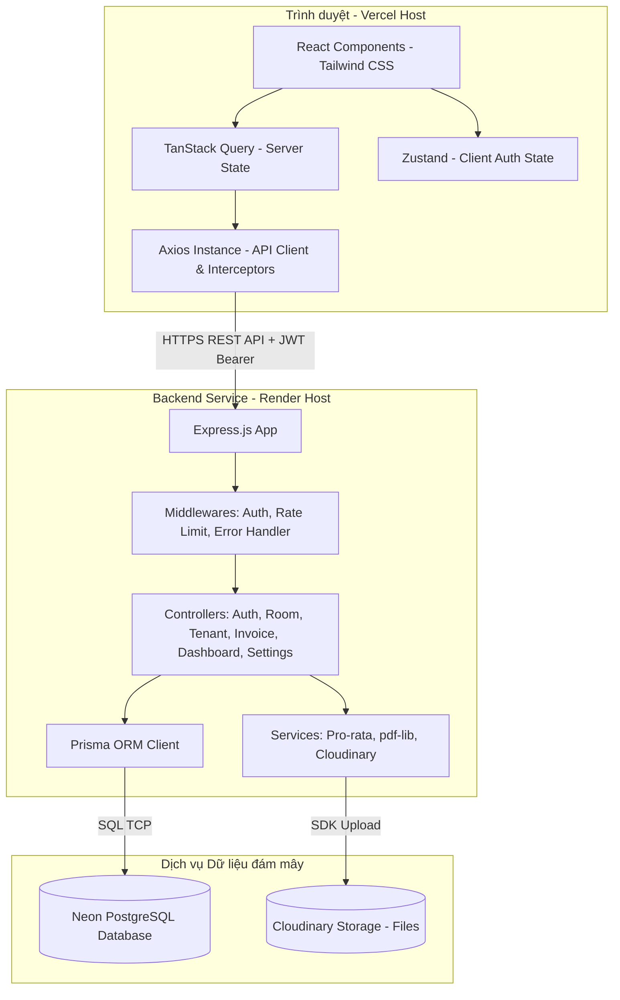

# Design Document

## Overview

Tài liệu thiết kế kỹ thuật này mô tả chi tiết kiến trúc hệ thống, ranh giới quản lý trạng thái, mô hình dữ liệu cơ sở dữ liệu, các thành phần giao diện, chiến lược xử lý lỗi và các tiêu chí đánh giá heuristic của ứng dụng **House Renting App**. 

Mục tiêu thiết kế là xây dựng một ứng dụng web Single Page Application (SPA) tách biệt hoàn toàn giữa giao diện người dùng và nghiệp vụ xử lý API, tối ưu hóa trải nghiệm người dùng dựa trên các tiêu chí tương tác tức thời (Instant Interaction), kiên cố hóa trước lỗi mạng và có khả năng phục hồi dữ liệu tự động.

---

## Architecture

Kiến trúc hệ thống được thiết kế theo mô hình Client-Server tiêu chuẩn, tận dụng các dịch vụ Cloud serverless miễn phí để tối ưu hóa chi phí vận hành mà vẫn đảm bảo hiệu năng cao:



### Phân định Trạng thái (State Boundaries)

Để đảm bảo hiệu năng và tính bảo mật cao nhất, hệ thống phân chia rõ ràng các ranh giới lưu trữ trạng thái:

1. **Client Auth State (Zustand)**:
   - `accessToken`: Lưu trong bộ nhớ RAM (Memory state). Mất đi khi tải lại trang (F5) để ngăn chặn tấn công đánh cắp token qua XSS.
   - `refreshToken` & `user`: Lưu trong `localStorage` để tự động khôi phục phiên đăng nhập khi mở lại trình duyệt.
2. **Server State (TanStack Query)**:
   - Toàn bộ dữ liệu nghiệp vụ (danh sách phòng, khách thuê, hóa đơn, thông tin Dashboard, cài đặt) PHẢI được quản lý bởi TanStack Query.
   - Sử dụng cơ chế `staleTime` và `cacheTime` hợp lý để giảm thiểu số lượng HTTP request trùng lặp.
   - Sử dụng `mutations` kèm theo `onSuccess` để tự động làm mới (invalidate queries) các danh sách liên quan ngay lập tức sau khi thay đổi dữ liệu, đem lại cảm giác tương tác phản hồi tức thì.
3. **Local UI State (React `useState`)**:
   - Quản lý các trạng thái cục bộ như: Đóng/mở Dialog modal, từ khóa tìm kiếm tạm thời trong ô nhập, giá trị các trường trong Form trước khi submit.

---

## Components and Interfaces

Hệ thống giao diện được tổ chức thành các trang và thành phần tái sử dụng, bám sát các luồng trải nghiệm người dùng:

### 1. App Shell Layout (`AppLayout.jsx`)
- **Vai trò**: Cung cấp khung giao diện thống nhất gồm thanh điều hướng Sidebar bên trái (Dashboard, Phòng trọ, Khách thuê, Hóa đơn, Cài đặt) và thanh tiêu đề Header bên trên (thông tin tài khoản chủ trọ và nút Đăng xuất).
- **Hành vi**: Tự động ẩn Sidebar trên thiết bị di động và thay thế bằng nút Menu Drawer trượt mượt mà.

### 2. Dashboard Page (`DashboardPage.jsx`)
- **Thành phần Stat Card**: Hiển thị 4 thẻ thông tin tài chính lớn kèm theo các biểu tượng trực quan từ Lucide.
- **Thành phần Cảnh báo (AlertList)**: Hiển thị 2 danh sách dạng danh mục thu gọn (accordion hoặc thẻ trượt): các hóa đơn chưa thu tiền của tháng và danh sách khách hàng sắp trả phòng.
- **Thành phần Biểu đồ**: Tích hợp Recharts responsive tự động co giãn theo kích thước khung chứa để hiển thị Biểu đồ cột Doanh thu và Biểu đồ đường Tỷ lệ lấp đầy.

### 3. Room Management Pages (`RoomsPage.jsx` & `RoomDetailPage.jsx`)
- **Trang danh sách**: Hiển thị bảng dữ liệu phòng trọ với bộ lọc nhanh trạng thái. Tích hợp nút thêm phòng mở Dialog form nhập liệu nhanh.
- **Trang chi tiết**: Hiển thị thẻ thông tin phòng, thông tin liên lạc của khách thuê hiện tại (nếu có), và bảng lịch sử hóa đơn kèm phân trang.

### 4. Tenant Management Pages (`TenantsPage.jsx` & `TenantDetailPage.jsx`)
- **Trang danh sách**: Thiết kế dạng Grid Card hiện đại thể hiện chân dung khách thuê, số điện thoại, tên phòng đang ở và tiền đặt cọc.
- **Trang chi tiết**: 
  - Thẻ thông tin cá nhân và hợp đồng chi tiết.
  - Khu vực Upload tệp đính kèm (`Multer` + `Cloudinary` backend integration) hỗ trợ kéo thả tệp, hiển thị danh mục ảnh CCCD hoặc tệp hợp đồng PDF đã tải lên, kèm nút xóa tệp nhanh.
  - Nút hành động "Trả phòng" kích hoạt Dialog xác nhận để chuyển trạng thái an toàn.

### 5. Invoice Management Pages (`InvoicesPage.jsx` & `InvoiceDetailPage.jsx` & `InvoiceCreatePage.jsx`)
- **Trang danh sách**: Quản lý bộ lọc thông minh theo Tháng/Năm, theo phòng và trạng thái thanh toán.
- **Màn hình Tạo hóa đơn hàng loạt**: Giao diện tối ưu hóa nhập liệu. Chủ trọ chọn tháng/năm, hệ thống tự động render danh sách các phòng trọ đang có khách thuê, hiển thị chỉ số điện/nước cũ và ô để nhập nhanh chỉ số mới.
- **Trang chi tiết hóa đơn**:
  - Bảng chi tiết tính toán từng dòng chi phí rõ ràng.
  - Form ghi nhận thanh toán (Dialog) để nhập số tiền thu thực tế (`paidAmount`).
  - Khung xem trước PDF hóa đơn (PDF Previewer) nhúng trực tiếp trong trang và nút "Tải xuống PDF".

### 6. Settings Page (`SettingsPage.jsx`)
- Form cấu hình thông tin nhà trọ (Tên nhà trọ, địa chỉ, số điện thoại, ảnh Logo thương hiệu).
- Form cấu hình thông tin ngân hàng nhận tiền (Tên ngân hàng thụ hưởng, số tài khoản, tên chủ tài khoản).
- Nút xuất dữ liệu Backup dạng CSV.

---

## Data Models

Hệ thống sử dụng cơ sở dữ liệu PostgreSQL thông qua Prisma ORM với cấu trúc lược đồ (Prisma Schema) chặt chẽ, tối ưu hóa các quan hệ toàn vẹn dữ liệu:

```prisma
model User {
  id            Int            @id @default(autoincrement())
  email         String         @unique
  password      String
  name          String
  createdAt     DateTime       @default(now())
  rooms         Room[]
  invoices      Invoice[]
  refreshTokens RefreshToken[]
  settings      Settings?
}

model RefreshToken {
  id        Int      @id @default(autoincrement())
  token     String   @unique
  userId    Int
  user      User     @relation(fields: [userId], references: [id], onDelete: Cascade)
  expiresAt DateTime
  createdAt DateTime @default(now())
}

model Settings {
  id        Int      @id @default(autoincrement())
  userId    Int      @unique
  user      User     @relation(fields: [userId], references: [id])
  shopName  String   @default("Nhà trọ")
  address   String   @default("")
  phone     String   @default("")
  logoUrl   String?
  bankName  String   @default("")
  bankAcc   String   @default("")
  bankOwner String   @default("")
  updatedAt DateTime @updatedAt
}

enum RoomStatus {
  AVAILABLE
  OCCUPIED
  MAINTENANCE
}

model Room {
  id            Int        @id @default(autoincrement())
  name          String
  floor         Int?
  area          Float?
  baseRent      Int
  electricPrice Int        @default(3500)
  waterPrice    Int        @default(15000)
  garbageFee    Int        @default(20000)
  status        RoomStatus @default(AVAILABLE)
  userId        Int
  user          User       @relation(fields: [userId], references: [id])
  tenants       Tenant[]
  invoices      Invoice[]
  createdAt     DateTime   @default(now())
}

model Tenant {
  id          Int          @id @default(autoincrement())
  name        String
  phone       String
  idCard      String?
  roomId      Int
  room        Room         @relation(fields: [roomId], references: [id])
  moveInDate  DateTime
  moveOutDate DateTime?
  deposit     Int          @default(0)
  active      Boolean      @default(true)
  files       TenantFile[]
  invoices    Invoice[]
  createdAt   DateTime     @default(now())
}

model TenantFile {
  id        Int      @id @default(autoincrement())
  tenantId  Int
  tenant    Tenant   @relation(fields: [tenantId], references: [id], onDelete: Cascade)
  label     String
  url       String
  createdAt DateTime @default(now())
}

model Invoice {
  id               Int       @id @default(autoincrement())
  roomId           Int
  room             Room      @relation(fields: [roomId], references: [id])
  tenantId         Int
  tenant           Tenant    @relation(fields: [tenantId], references: [id])
  userId           Int
  user             User      @relation(fields: [userId], references: [id])
  month            Int
  year             Int
  baseRent         Int
  electricityPrev  Int
  electricityNow   Int
  electricityPrice Int
  waterPrev        Int
  waterNow         Int
  waterPrice       Int
  garbageFee       Int
  otherFees        Int       @default(0)
  otherNote        String?
  periodStart      DateTime
  periodEnd        DateTime
  totalAmount      Int
  paid             Boolean   @default(false)
  paidDate         DateTime?
  paidAmount       Int?
  note             String?
  createdAt        DateTime  @default(now())

  @@unique([roomId, tenantId, month, year])
}
```

---

## QR Code Specification (Static Priority + VietQR Fallback)

Kiến trúc nhúng mã QR thanh toán trên hệ thống áp dụng chiến lược **hai tầng ưu tiên** để đảm bảo khả năng quét chính xác 100% trên mọi ứng dụng ngân hàng di động tại Việt Nam:

### 1. Tầng ưu tiên: Ảnh QR tĩnh (Static QR Asset)
- Hệ thống kiểm tra sự tồn tại của tệp ảnh tĩnh tại `backend/assets/qr_code.png` bằng `fs.existsSync()`.
- Nếu tệp tồn tại, nhúng trực tiếp ảnh PNG vào PDF hóa đơn bằng `pdfDoc.embedPng()`.
- Kích thước nhúng: **rộng 110 × cao 215** (giữ tỷ lệ khung hình đứng dọc ~1:2 đặc thù của thẻ QR ngân hàng Techcombank).
- Căn giữa theo chiều ngang trang A4: `qrX = (width - qrWidth) / 2`.
- **Ưu điểm**: Mã QR được tạo trực tiếp từ ứng dụng ngân hàng nên đảm bảo 100% tuân thủ chuẩn quét, không cần tự sinh chuỗi EMVCo phức tạp.

### 2. Tầng dự phòng: VietQR động (Dynamic VietQR Fallback)
Khi tệp `qr_code.png` không tồn tại, hệ thống chuyển sang cơ chế sinh mã QR động tuân thủ mô hình **EMVCo Merchant-Presented Mode (MPM)**:

#### Cấu trúc Tag EMVCo
Chuỗi ký tự VietQR được phân tích và sinh tự động gồm các trường (Tag-Length-Value):
- **Tag 00 (Payload Format Indicator)**: Cố định `"01"`
- **Tag 01 (Point of Initiation Method)**: 
  - `"11"` (Static QR): Sử dụng khi không đính kèm số tiền cụ thể trong cài đặt hoặc khi hóa đơn không có số tiền.
  - `"12"` (Dynamic QR): Bắt buộc khi có số tiền giao dịch cụ thể (`amount > 0`). Giúp ứng dụng ngân hàng khóa trường nhập số tiền, ngăn chặn khách thuê nhập sai số tiền hóa đơn.
- **Tag 38 (Merchant Account Information - Napas)**:
  - *AID (Tag 00)*: `"A000000727"` (Napas AID).
  - *Napas Consumer Info (Tag 01)*: Chứa Bank BIN (Sub-tag 00, 6 chữ số) và Số tài khoản (Sub-tag 01, tối đa 19 ký tự số).
  - *Service Code (Tag 02)*: `"QRIBFTTA"` (Chuyển khoản nhanh Napas 24/7 đến Tài khoản).
- **Tag 52 (Merchant Category Code)**: Cấu hình mặc định `"0000"` (Bắt buộc theo chuẩn EMVCo).
- **Tag 53 (Transaction Currency)**: `"704"` (Mã tiền tệ VND).
- **Tag 54 (Transaction Amount)**: Giá trị hóa đơn làm tròn số nguyên (`Math.round(totalAmount)`).
- **Tag 58 (Country Code)**: `"VN"`.
- **Tag 59 (Merchant Name)**: Tên thương hiệu nhà trọ, chuẩn hóa không dấu viết hoa (`shopName` của chủ trọ) hoặc mặc định `"HOUSE RENTING"`.
- **Tag 60 (Merchant City)**: Cố định `"HA NOI"` (Hoặc thành phố từ cài đặt nếu hợp lệ).
- **Tag 62 (Additional Data Field Template)**:
  - *Reference Label (Tag 08)*: Nội dung chuyển khoản chuẩn hóa không dấu viết hoa (ví dụ: `"PHONG 101 TT TIEN NHA T5"`), tối đa 25 ký tự.
- **Tag 63 (CRC-16 Checksum)**: 4 ký tự Hex viết hoa, tính bằng thuật toán CRC-16 CCITT (polynomial: `0x1021`, initial value: `0xFFFF`, no final XOR).

### 3. Thuật toán kiểm soát chất lượng & Kiểm thử
- **Unit Test độc lập**: Viết kịch bản kiểm thử độc lập chạy trực tiếp trên Backend để xác thực hai hàm cốt lõi `parsePaymentInfo` và `buildVietQRString` với các trường hợp biên (tên ngân hàng viết thường/viết hoa/viết tắt, số tài khoản có ký tự đặc biệt, số tiền lẻ thập phân, nội dung chuyển khoản tiếng Việt có dấu phức tạp).
- **Happy Path Integration**: Trình giả lập E2E Playwright kiểm duyệt việc hiển thị giao diện xem trước hóa đơn và kiểm duyệt API endpoint tải PDF trả về đúng tệp nhúng ảnh QR (tĩnh hoặc động) thành công.


---

## Error Handling

Hệ thống xử lý lỗi đồng bộ trên cả Frontend và Backend để đảm bảo tính kiên cố và thân thiện với người dùng:

### 1. Phản hồi lỗi chuẩn hóa từ Backend
Mọi API route khi gặp lỗi đều PHẢI trả về mã trạng thái HTTP phù hợp cùng cấu trúc JSON chuẩn hóa:
```json
{
  "success": false,
  "message": "Thông điệp lỗi mô tả bằng tiếng Việt rõ ràng",
  "code": "ERROR_CODE_UPPERCASE"
}
```

Các mã lỗi nghiệp vụ quy định:
- `ROOM_NOT_FOUND`: Phòng không tồn tại hoặc không thuộc quyền sở hữu của User hiện tại.
- `ROOM_OCCUPIED`: Phòng đã có người thuê hoạt động, không thể nhận thêm khách mới.
- `TENANT_NOT_FOUND`: Khách thuê không tồn tại hoặc đã bị xóa.
- `INVOICE_DUPLICATE`: Hóa đơn cho phòng này, khách thuê này trong tháng/năm đã tồn tại (ràng buộc @@unique).
- `VALIDATION_ERROR`: Lỗi kiểm tra định dạng dữ liệu đầu vào (Zod Schema validation thất bại).
- `UNAUTHORIZED`: Token không hợp lệ, đã hết hạn hoặc thiếu thông tin xác thực.

### 2. Cơ chế phục hồi tự động ở Frontend
- **Axios Interceptors**:
  - Tự động gắn token JWT vào Header của mọi request.
  - Phát hiện lỗi `401 Unauthorized` từ API → tự động thực hiện luồng Silent Refresh. NẾU Silent Refresh thất bại (Refresh Token hết hạn) → tự động xóa bộ nhớ auth, chuyển hướng người dùng về trang `/login` kèm thông báo hết hạn phiên làm việc.
- **TanStack Query Global Error Handler**:
  - Bắt các lỗi mạng hoặc API thất bại, tự động hiển thị Toast thông báo lỗi tiếng Việt thông qua thư viện `sonner` mà không làm gián đoạn luồng làm việc hiện tại của người dùng.
- **Form Inline Errors**:
  - Kết hợp `react-hook-form` và `zod` để validate dữ liệu ngay tại client. Chỉ cho phép gửi request lên API khi toàn bộ các trường dữ liệu hợp lệ. Hiển thị thông báo lỗi màu đỏ ngay dưới chân từng ô nhập liệu bị sai.

---

## Testing & Usability Heuristics Strategy

Để nâng cấp dự án đạt chuẩn **Product-Grade**, chiến lược kiểm thử và đánh giá trải nghiệm người dùng được ánh xạ trực tiếp vào 10 nguyên lý Usability Heuristics của Jakob Nielsen:

### 1. Ánh xạ các tiêu chí Heuristics (Heuristic Mapping)
- **H1: Visibility of system status (Hiển thị trạng thái hệ thống)**:
  - Hiển thị Skeleton placeholder đẹp mắt trong thời gian tải dữ liệu phòng/khách thuê/hóa đơn, thay thế cho màn hình đơ hoặc spinner nhàm chán.
  - Sử dụng **WakeUpBanner** hiển thị thông báo thân thiện và tiến trình khởi động của máy chủ Render Free Tier khi gặp tình trạng Cold Start (>10 giây).
  - Trạng thái thanh toán hóa đơn, trạng thái phòng trọ luôn hiển thị màu sắc trực quan (màu xanh/đỏ/vàng) phản ánh chính xác dữ liệu thực tế tức thì.
- **H2: Match between system and the real world (Tương thích với thực tế)**:
  - Ngôn ngữ giao diện hoàn toàn bằng tiếng Việt chuyên ngành quản lý nhà trọ (tiền phòng, số điện, số nước, tiền rác, đặt cọc, trả phòng, xuất hóa đơn).
  - Thuật toán Pro-rata tính toán chia ngày lẻ chính xác như cách tính thủ công ngoài đời của các chủ nhà trọ khi khách vào ở giữa tháng.
- **H3: User control and freedom (Quyền kiểm soát của người dùng)**:
  - Mọi thao tác quan trọng như Xóa phòng, Xóa khách thuê, Trả phòng, Tạo hóa đơn hàng loạt đều PHẢI hiển thị Dialog xác nhận trước khi thực hiện, hỗ trợ nút Hủy (Cancel) để người dùng rút lui an toàn.
- **H4: Consistency and standards (Sự nhất quán và tiêu chuẩn)**:
  - Giao diện thiết kế theo hệ thống Design System đồng bộ dựa trên CSS Tailwind và các component UI tiêu chuẩn (shadcn).
  - Định dạng hiển thị tiền tệ (VND với dấu phân cách hàng nghìn) và định dạng ngày tháng (DD/MM/YYYY) nhất quán trên tất cả các trang, bảng biểu, và trên hóa đơn PDF.
- **H5: Error prevention (Phòng tránh lỗi)**:
  - Vô hiệu hóa (disable) nút "Lưu" hoặc "Tạo" khi Form đang submit hoặc dữ liệu nhập vào không hợp lệ để tránh gửi request trùng lặp (Double submit).
  - Tự động lấy số điện/nước mới của tháng trước làm số điện/nước cũ của tháng này trong giao diện tạo hóa đơn hàng loạt, ngăn chặn sai sót nhập liệu chỉ số cũ từ chủ nhà trọ.
- **H6: Recognition rather than recall (Nhận diện thay vì ghi nhớ)**:
  - Màn hình lập hóa đơn hiển thị đầy đủ thông tin tên khách thuê và chỉ số cũ ngay cạnh ô nhập chỉ số mới để chủ nhà không cần phải tra cứu lại sổ sách cũ.
- **H9: Help users recognize, diagnose, and recover from errors (Hỗ trợ người dùng nhận diện và sửa lỗi)**:
  - Khi API trả về lỗi (như trùng hóa đơn, số điện mới nhỏ hơn số điện cũ), hệ thống hiển thị thông báo lỗi chi tiết bằng tiếng Việt trên Toast để chủ trọ biết rõ nguyên nhân và cách khắc phục thay vì hiện mã lỗi kỹ thuật khó hiểu.

### 2. Chiến lược Xác thực và Đánh giá (Validation Process)
- Thực hiện kiểm duyệt responsive trên đa thiết bị (Desktop, Tablet, Mobile) đảm bảo không có hiện tượng vỡ khung hay xuất hiện thanh cuộn ngang khó chịu.
- Tiến hành audit heuristic cho toàn bộ các màn hình chính (Dashboard, Phòng trọ, Khách thuê, Hóa đơn, Cài đặt) và tối ưu hóa các điểm vi phạm heuristic cấp độ nhẹ đến nặng trước khi bàn giao.
